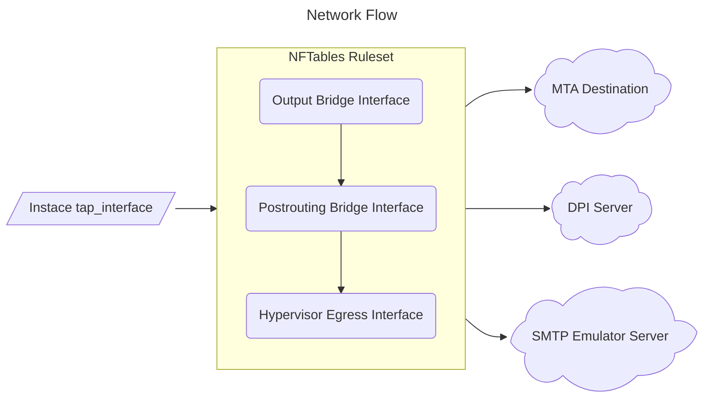

```mermaid
---
title: Network Flow
---
flowchart LR
    
    tap_int["Instace tap_interface"]@{ shape: in-out }

    subgraph firewall["NFTables Ruleset"]
        output_br["Output Bridge Interface"]@{ shape: event }
        post_ro_br["Postrouting Bridge Interface"]@{ shape: event }
        egress["Hypervisor Egress Interface"]@{ shape: event }
    end

    net["MTA Destination"]@{ shape: cloud }
    dpi["DPI Server"]@{ shape: cloud }
    em{"SMTP Emulator Server"}@{ shape: cloud }

    tap_int --> firewall
    output_br --> post_ro_br --> egress
    firewall --> net
    firewall --> dpi
    firewall --> em
```
