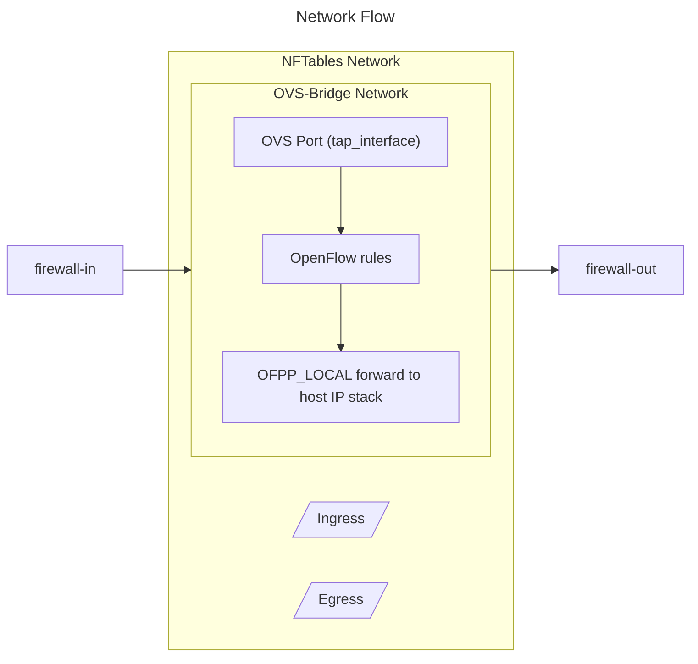

```mermaid
---
title: Network Flow
---
flowchart LR
    
    subgraph firewall["NFTables Network"]
        ingress["Ingress"]@{ shape: lean-r }

        subgraph libvirt["OVS-Bridge Network"]
            ovs-port["OVS Port (tap_interface)"]
            ovs-eval["OpenFlow rules"]
            ovs-forward["OFPP_LOCAL forward to host IP stack"]
    
            ovs-port --> ovs-eval --> ovs-forward
        end

        egress["Egress"]@{ shape: lean-r}
    end

    firewall-in --> libvirt --> firewall-out
```
