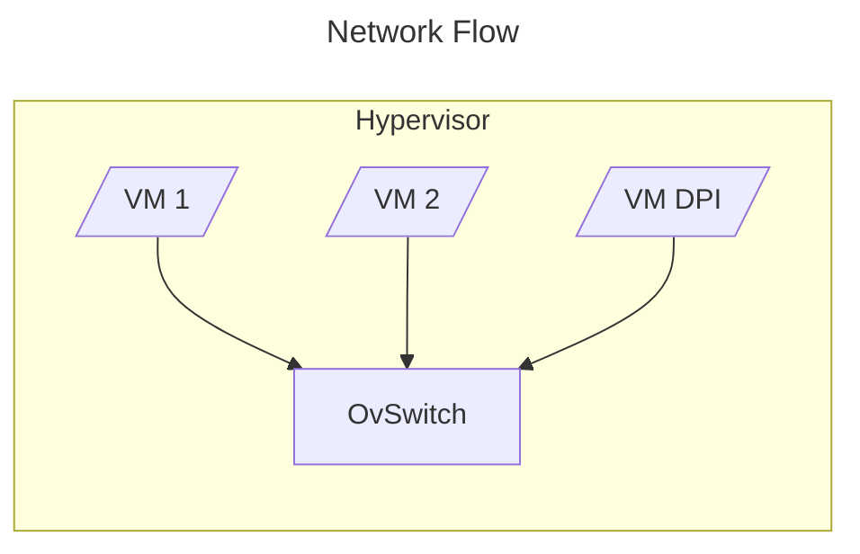

```mermaid
---
title: Network Flow
---
flowchart LR
    
    subgraph hyper["Hypervisor"]
        vm_1["VM 1"]@{ shape: lean-r }
        vm_2["VM 2"]@{ shape: lean-r }
        vm_DPI["VM DPI"]@{ shape: lean-r }
        
        vm_1 --> ovs["OvSwitch"]
        vm_2 --> ovs
        vm_DPI --> ovs
    end
```
