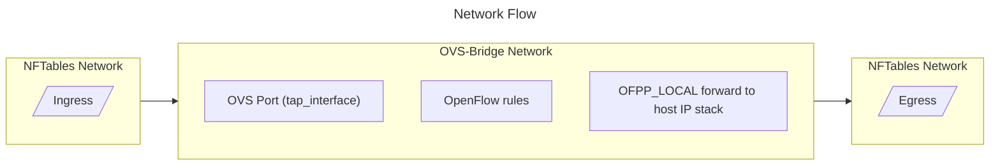

```mermaid
---
title: Network Flow
---
flowchart LR
    
    subgraph firewall-in["NFTables Network"]
        ingress["Ingress"]@{ shape: lean-r }
    end

    subgraph libvirt["OVS-Bridge Network"]
        ovs-port["OVS Port (tap_interface)"]
        ovs-eval["OpenFlow rules"]
        ovs-forward["OFPP_LOCAL forward to host IP stack"]
    end

    subgraph firewall-out["NFTables Network"]
        egress["Egress"]@{ shape: lean-r}
    end

    firewall-in --> libvirt --> firewall-out
```
