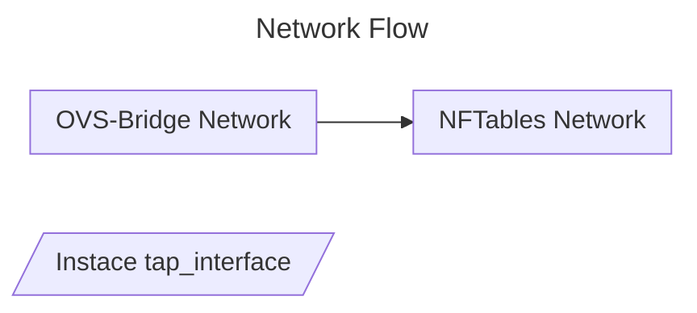

```mermaid
---
title: Network Flow
---
flowchart LR
    
    tap_int["Instace tap_interface"]@{ shape: in-out }

    subgraph libvirt["OVS-Bridge Network"]

    end

    subgraph firewall["NFTables Network"]

    end

    libvirt --> firewall
```
