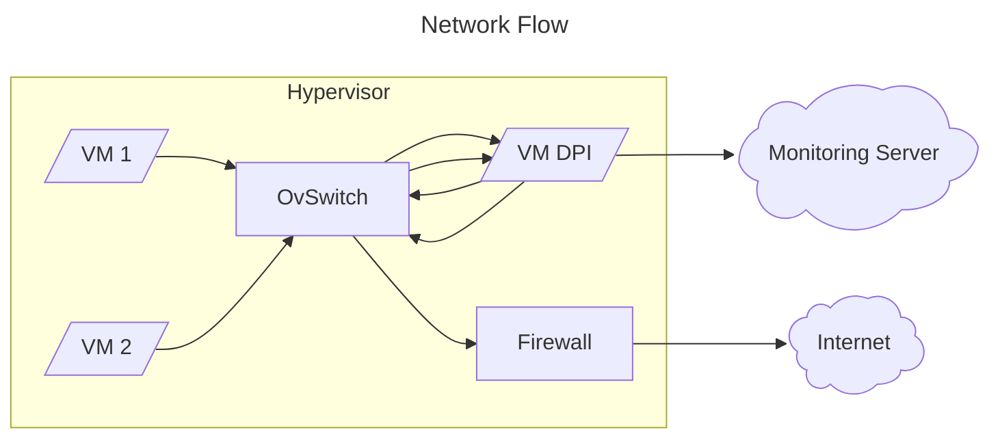

```mermaid
---
title: Network Flow
---
flowchart LR
    
    subgraph hyper["Hypervisor"]
        vm_1["VM 1"]@{ shape: lean-r }
        vm_2["VM 2"]@{ shape: lean-r }
        vm_dpi["VM DPI"]@{ shape: lean-r }
        
        vm_1 --> ovs["OvSwitch"]
        vm_2 --> ovs
        vm_dpi --> ovs & ovs --> vm_dpi

        ovs --> fire["Firewall"]
    end

    fire --> net["Internet"]@{ shape: cloud }
    vm_dpi --> monitor["Monitoring Server"]@{ shape: cloud }
```
